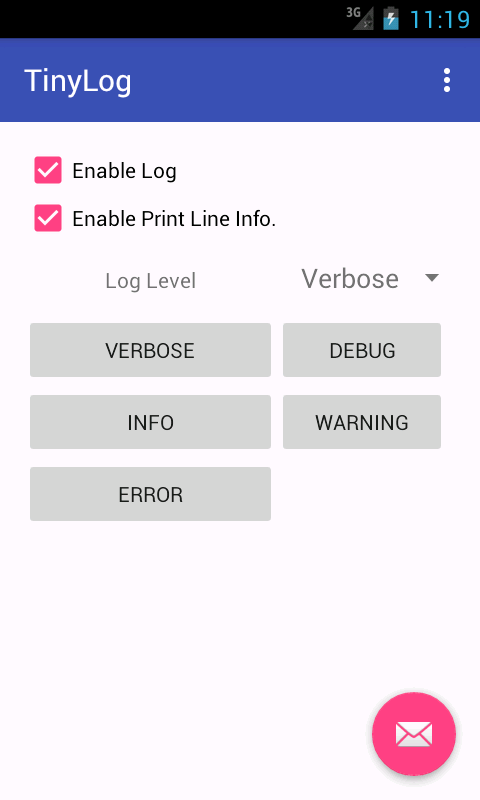

### Tiny Log 

A tiny, power and easy to use android log. 短小精悍的Android日志类。



### Integration

Step 1. Add the JitPack repository at the end of repositories in your root `build.gradle` file.

```
allprojects {
    repositories {
        maven { url "https://jitpack.io" }
    }
}
```

Step 2. Add the dependency

```
dependencies {
    compile 'com.github.whinc:tiny-log:0.1'
}
```


### Features

* single class and all method is static, you can use just like built-in Log class in Android.
* enable/disable log
* set log level used to filter different log level
* print file name, class name, method name and line number
* jump to source
* print log call stack (you can specified the stack depth)
* provide interface `Formatter` used to define yourself output formatter
* provide interface `Interceptor` used to intercept the default log handle.

Log demos:

    // default formatter
    Log.i(TAG, "default output format");
    ... I/MainActivity: com.whinc.util.test.MainActivity.testLog(MainActivity.java:91):default output format

    // custom formmatter
    Log.Formatter formatter = new Log.Formatter() { ... }
    Log.setFormatter(formatter);
    Log.i(TAG, "custom formatter");
    ...I/MainActivity: ---------------------------------
    ...I/MainActivity: - Thread:main
    ...I/MainActivity: ---------------------------------
    ...I/MainActivity: - com.whinc.util.test.MainActivity.testLog (MainActivity.java:125)
    ...I/MainActivity: ---------------------------------
    ...I/MainActivity: - custom formatter
    ...I/MainActivity: ---------------------------------

### How to use

Primary method of `Log` class:

    // v, d, i, w, e
    public static void v(String tag, String msg);
    public static void v(String tag, String msg, int callStackDepth);
    public static void v(String tag, String msg, Throwable tr);

    public static void enable(boolean b);
    public static void level(@Level int level);
    public static void enablePrintLineInfo(boolean b);
    public static Formatter setFormatter(Formatter formatter);
    public static void setInterceptor(Interceptor interceptor);
    public static String getStackString(Throwable tr);

Normal usage:

    Log.i(TAG, "default output format");
    // logcat output
    ... I/MainActivity: com.whinc.util.test.MainActivity.testLog(MainActivity.java:91):default output format

    int callStackDepth = 3;
    Log.i(TAG, "default output format"， callStackDepth);
    // logcat output
    ... I/MainActivity: com.whinc.util.test.MainActivity.testLogInfo(MainActivity.java:91):default output format
    ... I/MainActivity: com.whinc.util.test.MainActivity.testLog(MainActivity.java:130)
    ... I/MainActivity: com.whinc.util.test.MainActivity.onOptionsItemSelected(MainActivity.java:49)

    Log.i(TAG, "default output format", new Throwable());
    // logcat output
    ... I/MainActivity﹕ com.whinc.util.test.MainActivity.testLog(MainActivity.java:92):default output format
        java.lang.Throwable
                at com.whinc.util.test.MainActivity.testLog(MainActivity.java:92)
                at com.whinc.util.test.MainActivity.onOptionsItemSelected(MainActivity.java:49)
                at android.app.Activity.onMenuItemSelected(Activity.java:2609)
                ......

Disable print line infomation:

    Log.enablePrintLineInfo(false);
    Log.i(TAG, "disable print line info");

    // logcat output
    ...I/MainActivity: disable print line info

Setup log level:

    Log.enablePrintLineInfo(false);
    Log.level(Log.INFO);
    Log.v(TAG, "verbose");
    Log.d(TAG, "debug");
    Log.i(TAG, "info");
    Log.w(TAG, "warn");
    Log.e(TAG, "error");

    // logcat output
    ...I/MainActivity: info
    ...W/MainActivity: warn
    ...E/MainActivity: error

Disable log:

    Log.enable(false);
    Log.v(TAG, "disable log");

    // logcat output none

Define custom output format:

    Log.Formatter formatter = new Log.Formatter() {

        @Override
        public String format(String msg, StackTraceElement e) {
            StringBuilder builder = new StringBuilder();
            String threadInfo = String.format("- Thread:%s\n", Thread.currentThread().getName());
            String lineInfo = String.format("- %s.%s (%s:%d)\n",
                        e.getClassName(), e.getMethodName(), e.getFileName(), e.getLineNumber());
            String msgInfo = String.format("- %s \n", msg);
            builder.append("---------------------------------\n")
                    .append(threadInfo)
                    .append("---------------------------------\n")
                    .append(lineInfo)
                    .append("---------------------------------\n")
                    .append(msgInfo)
                    .append("---------------------------------\n");
            return builder.toString();
        }
    };
    Log.setFormatter(formatter);
    Log.i(TAG, "custom formatter");

    // logcat output
    ...I/MainActivity: ---------------------------------
    ...I/MainActivity: - Thread:main
    ...I/MainActivity: ---------------------------------
    ...I/MainActivity: - com.whinc.util.test.MainActivity.testLog (MainActivity.java:125)
    ...I/MainActivity: ---------------------------------
    ...I/MainActivity: - custom formatter
    ...I/MainActivity: ---------------------------------

Intercept log output:

    Log.restoreDefaultSetting();
    Log.setInterceptor(new Log.Interceptor() {
        @Override
        public boolean onIntercept(String tag, String msg) {
            Log.v(TAG, "intercept " + msg);
            return true;        // return true to consume the log message
        }
    });
    Log.v(TAG, "AAA");
    Log.setInterceptor(new Log.Interceptor() {

        @Override
        public boolean onIntercept(String tag, String msg) {
            Log.v(TAG, "don't intercept " + msg);
            return false;       // return false to don't consume the log message
        }
    });
    Log.v(TAG, "BBB");

    // logcat output
    ...V/MainActivity﹕ com.whinc.util.test.MainActivity$3.onIntercept(MainActivity.java:142):intercept AAA
    ...V/MainActivity﹕ com.whinc.util.test.MainActivity$4.onIntercept(MainActivity.java:155):don't intercept BBB
    ...V/MainActivity﹕ com.whinc.util.test.MainActivity.testLog2(MainActivity.java:159):BBB

Reference to

[Logger](https://github.com/orhanobut/logger)
